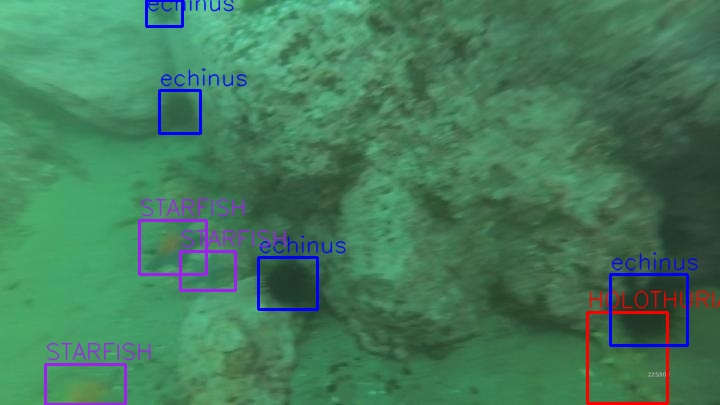
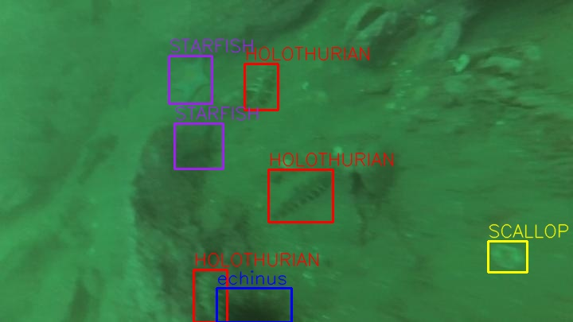
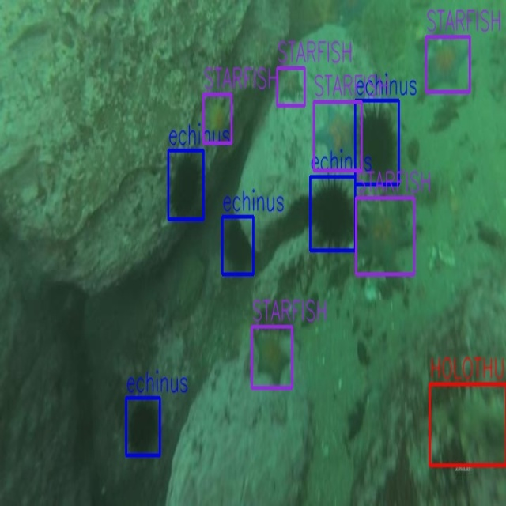
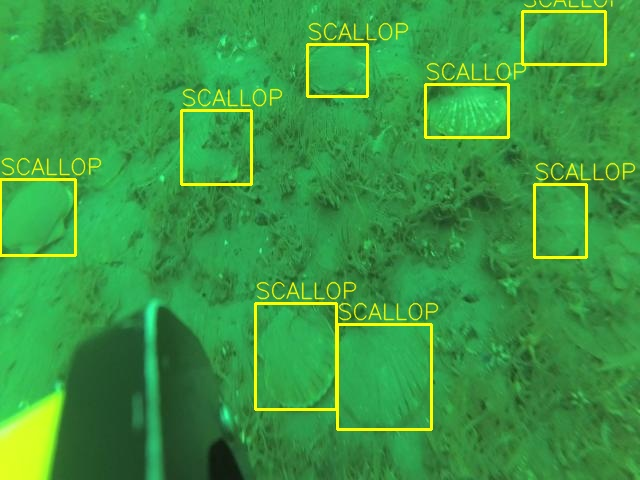
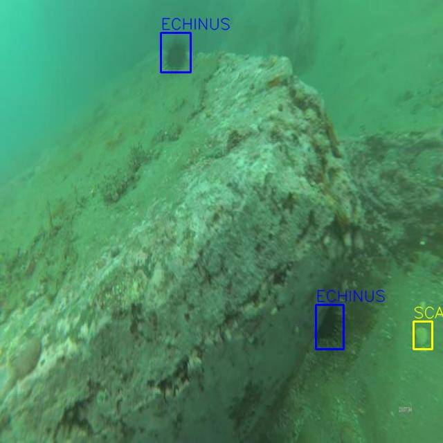
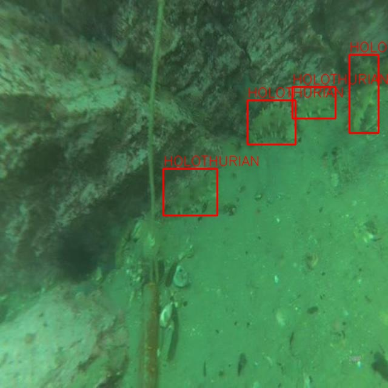
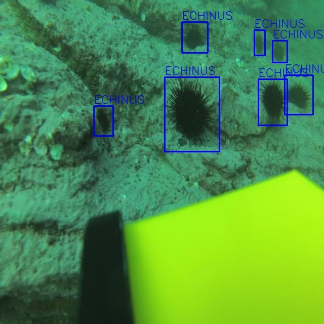

# Underwater Object Detection using YOLOv11

## 🐠 Introduction  

Underwater object detection plays a critical role in **marine research, aquaculture, environmental monitoring, and autonomous underwater vehicles (AUVs)**. Unlike object detection in natural scenes, underwater detection faces unique challenges due to the complexity of aquatic environments:  

- 🌊 **Light Distortion** – Absorption & scattering cause low visibility, poor contrast, and color shifts.  
- ⚪ **Water Turbidity** – Suspended particles blur images and add noise.  
- 🐟 **Occlusions & Shape Changes** – Objects overlap, deform, or hide each other.  
- 🌐 **Domain Variability** – Differences in depth, regions, and capture devices hinder generalization.  
- 🦀 **Small & Camouflaged Targets** – Many species are tiny or blend into their surroundings.

This project employ YOLOv11 - the latest version of yolo, and compare its performance with previous versions (YOLOv8 and YOLOv10) across multiple datasets. The goal is to evaluate how the modern YOLO architecture performs in challenging underwater environments.

## YOLOv11: Key Advancements
YOLOv11 represents the latest evolution of the YOLO family, bringing improvements in both accuracy and efficiency.  
Compared to its predecessors, YOLOv11 introduces:
- **Stronger architecture**: Incorporates novel components including **C3k2**, **SPPF**, and **C2PSA**, which significantly enhance feature extraction and spatial focus. These architectural upgrades allow the model to better capture fine-grained details, making it more robust in complex detection tasks.
- **Improved efficiency**: Optimized for faster inference without sacrificing accuracy, making it suitable for both research and real-time applications.
- **Enhanced training strategies**: Includes refined data augmentation, label assignment, and loss balancing techniques, which improve convergence and generalization across different datasets.

## 📊 Datasets
To evaluate the performance of our model, we conducted experiments on four diverse and challenging underwater datasets:
- **DUO Dataset**: A large-scale underwater object detection dataset containing diverse marine species. It includes **four classes**: *echinus, holothurian, scallop, starfish*.
  

  
  
  
  

 

- **URPC2019 Dataset**: Released as part of the Underwater Robot Picking Contest 2019, featuring underwater objects under varying visibility and lighting conditions. Same as **DUO Dataset**, it also includes **four classes**: *echinus, holothurian, scallop, starfish*.  

  
  
  
  

 

- **UDD Dataset**: A comprehensive underwater detection dataset. It includes **three classes**: *scallop, seacucumber, seaurchin*.

  
  
  
  

 

- **Brackish Dataset**: Collected in brackish water environments, featuring species and objects that differ from open-sea datasets. It includes **six classes**: *crab, fish, jellyfish, shirmp, small fish, starfish*.

  
  
  
  

 
